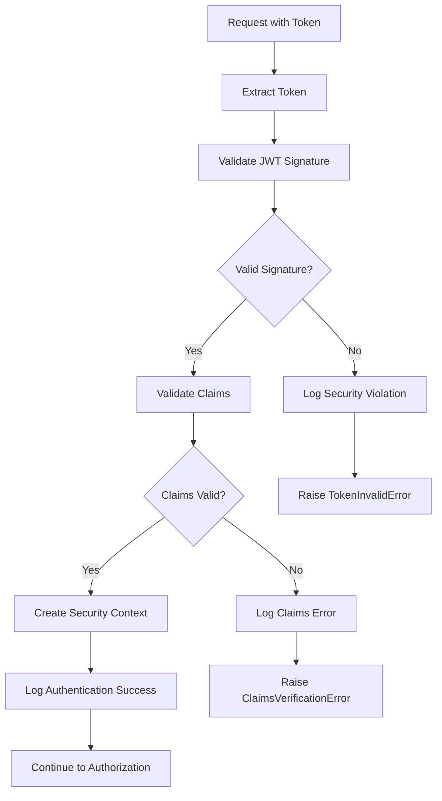
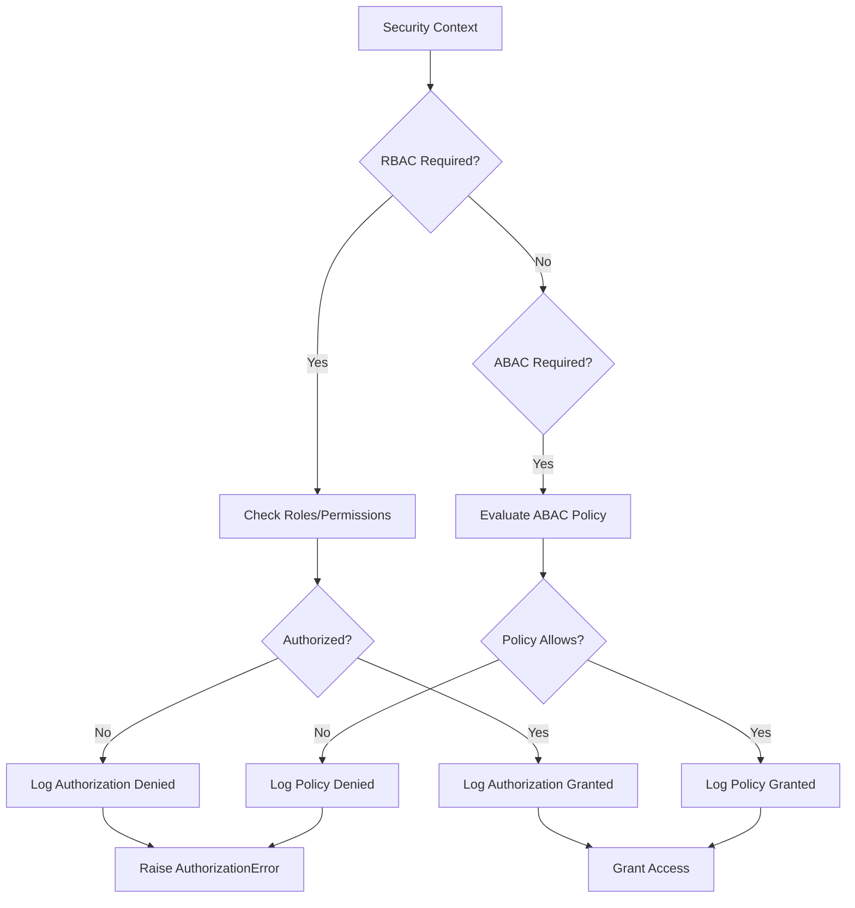

# Enhanced Security Architecture - Updated

## Overview

The Marty Microservices Framework features enterprise-grade security with unified access control, real-time service mesh integration, and comprehensive policy enforcement. This document outlines the enhanced security architecture that has been **consolidated and improved** to address multiple security implementations and provide a single, cohesive security system.

## Recent Architectural Changes (October 2025)

### Key Consolidation Changes

1. **Eliminated Duplicate SecurityManager Implementations**
   - **Problem**: Multiple SecurityManager classes existed across different modules (decorators.py, framework.py, unified_framework.py)
   - **Solution**: Consolidated into a single `ConsolidatedSecurityManager` that integrates with the existing `UnifiedSecurityFramework`
   - **Benefits**: Reduced complexity, consistent API, easier maintenance

2. **Enhanced Security Decorators with Robust Error Handling**
   - **Problem**: Decorators had basic error handling and relied on context.security_manager without proper edge case handling
   - **Solution**: Comprehensive error handling for token expiry, malformation, claims verification, and authentication edge cases
   - **Features**:
     - Detailed token validation with categorized error types
     - Comprehensive audit logging for all security events
     - Graceful degradation for optional authentication
     - Support for both sync and async functions

3. **Comprehensive Audit Logging Integration**
   - **Problem**: Audit hooks were not tied to authorization decisions
   - **Solution**: All security operations now automatically log to the audit system
   - **Coverage**: Authentication success/failure, authorization decisions, token validation, policy evaluations

## Security Architecture Principles

### 1. Consolidated Security Management
- **Principle**: Single security manager for all operations
- **Implementation**: `ConsolidatedSecurityManager` using `UnifiedSecurityFramework`
- **Components**: JWT validation, RBAC/ABAC authorization, audit logging, policy engines
- **Benefits**: Consistent security model, reduced duplication, easier configuration

### 2. Robust Error Handling
- **Principle**: Comprehensive error handling for all security edge cases
- **Implementation**: Categorized security exceptions with detailed context
- **Components**: Token validation, claims verification, authorization failures
- **Benefits**: Better debugging, security incident detection, graceful degradation

### 3. Comprehensive Audit Trail
- **Principle**: All security decisions must be auditable
- **Implementation**: Automatic audit logging for all security operations
- **Components**: Authentication events, authorization decisions, policy evaluations, security violations
- **Benefits**: Compliance, incident investigation, security monitoring

### 4. Zero Trust Security Model
- **Principle**: Never trust, always verify
- **Implementation**: Every request is authenticated and authorized
- **Components**: mTLS, JWT verification, certificate-based authentication
- **Benefits**: Reduced attack surface, improved compliance

### 5. Policy as Code
- **Principle**: Authorization policies defined as code
- **Implementation**: Version-controlled policy definitions
- **Components**: OPA Rego policies, ABAC attribute conditions, RBAC role hierarchies
- **Benefits**: Auditability, consistency, rapid deployment

## Consolidated Security Architecture

### Core Components

#### 1. ConsolidatedSecurityManager
The central security manager that replaces multiple duplicate implementations:

```python
from marty_msf.security import get_security_manager, configure_security_manager

# Get the global security manager
security_manager = get_security_manager()

# Or configure with custom settings
security_manager = configure_security_manager({
    "jwt_secret": "your-production-secret",
    "jwt_algorithm": "RS256",
    "enable_rbac": True,
    "enable_abac": True,
    "policy_engines": {
        "opa": {
            "enabled": True,
            "url": "http://opa:8181"
        }
    },
    "identity_providers": {
        "oidc": {
            "type": "oidc",
            "issuer": "https://auth.company.com"
        }
    }
})
```

#### 2. Enhanced Security Decorators
Robust decorators with comprehensive error handling:

```python
from marty_msf.security import requires_auth, requires_role, requires_abac

# Basic authentication with robust error handling
@requires_auth()
async def protected_endpoint(request: Request, security_context: SecurityContext):
    # Context is automatically injected
    return {"user": security_context.principal_id}

# Role-based authorization
@requires_role(["admin", "moderator"], require_all=False)
async def admin_endpoint(request: Request, security_context: SecurityContext):
    return {"message": "Admin access granted"}

# Fine-grained ABAC authorization
@requires_abac(
    resource="order",
    action="update",
    context_extractor=lambda *args, **kwargs: {
        "order_status": kwargs.get("order_status"),
        "request_time": datetime.now().isoformat()
    }
)
async def update_order(request: Request, order_id: str, security_context: SecurityContext):
    # Policy evaluation considers order status and time
    return {"message": f"Order {order_id} updated"}
```

#### 3. Comprehensive Error Handling
Categorized security exceptions with detailed context:

```python
from marty_msf.security.exceptions import (
    TokenExpiredError,
    TokenInvalidError,
    TokenMalformedError,
    ClaimsVerificationError,
    PermissionDeniedError,
    RoleRequiredError
)

try:
    context = await security_manager.authenticate_token(token)
except TokenExpiredError as e:
    # Token expired - specific handling
    logger.warning(f"Token expired for user, expiry: {e.expiry_time}")
    # Audit event automatically logged
except TokenInvalidError as e:
    # Invalid signature or other token issues
    logger.error(f"Invalid token: {e}")
    # Security violation automatically logged
except ClaimsVerificationError as e:
    # Claims validation failed
    logger.error(f"Claims verification failed: {e}")
```

#### 4. Automatic Audit Logging
All security operations are automatically audited:

```python
# Authentication attempts
security_manager.authenticate_token(token)
# → Automatically logs: TOKEN_VALIDATED, TOKEN_EXPIRED, AUTHENTICATION_FAILURE

# Authorization decisions
security_manager.authorize_rbac(context, ["admin"])
# → Automatically logs: AUTHORIZATION_GRANTED or AUTHORIZATION_DENIED

# ABAC policy evaluations
security_manager.authorize_abac(context, "resource", "action")
# → Automatically logs: Policy evaluation details, decision rationale
```

### Security Features

#### 1. Enhanced JWT Token Validation
Comprehensive token validation with detailed error categorization:

- **Signature Verification**: RSA/ECDSA/HMAC support with proper error handling
- **Claims Validation**: Required claims, custom validators, expiry handling
- **Error Categorization**: Expired, invalid signature, malformed, claims verification
- **Audit Integration**: All validation attempts logged with context

#### 2. RBAC with Hierarchical Roles
Role-based access control with inheritance:

```python
# Configure role hierarchy
security_manager.security_framework.role_hierarchy = {
    "admin": {"moderator", "user"},
    "moderator": {"user"}
}

# Role check automatically considers hierarchy
@requires_role("admin")  # Also grants access to admin inheritors
async def admin_function():
    pass
```

#### 3. ABAC with Policy Engines
Attribute-based access control with external policy evaluation:

```python
# Policy evaluation considers multiple attributes
@requires_abac(
    resource="document",
    action="read",
    context_extractor=lambda request, doc_id: {
        "document_classification": get_doc_classification(doc_id),
        "user_clearance": get_user_clearance(request),
        "time_of_access": datetime.now(),
        "request_ip": request.client.host
    }
)
async def read_document(request: Request, doc_id: str):
    # OPA policy evaluates all attributes
    pass
```

#### 4. External Identity Provider Integration
Support for multiple identity providers:

```python
# OIDC integration
security_manager.configure({
    "identity_providers": {
        "google": {
            "type": "oidc",
            "issuer": "https://accounts.google.com",
            "client_id": "your-client-id"
        },
        "azure_ad": {
            "type": "oidc",
            "issuer": "https://login.microsoftonline.com/tenant-id/v2.0",
            "client_id": "your-azure-client-id"
        }
    }
})
```

## Security Decision Flow

### 1. Authentication Flow


### 2. Authorization Flow


## Migration Guide

### From Old SecurityManager to ConsolidatedSecurityManager

#### Before (Multiple Managers)
```python
# Old - Multiple security managers
from marty_msf.security.decorators import SecurityManager
from marty_msf.security.framework import SecurityHardeningFramework
from marty_msf.security.unified_framework import UnifiedSecurityFramework

# Different initialization patterns
security_mgr = SecurityManager()
hardening_framework = SecurityHardeningFramework("service")
unified_framework = UnifiedSecurityFramework(config)
```

#### After (Consolidated Manager)
```python
# New - Single consolidated manager
from marty_msf.security import get_security_manager, configure_security_manager

# Simple initialization
security_manager = get_security_manager()

# Or with configuration
security_manager = configure_security_manager({
    "jwt_secret": "your-secret",
    "enable_rbac": True,
    "enable_abac": True
})
```

### Decorator Updates

#### Before (Basic Error Handling)
```python
@requires_auth
def old_endpoint(request):
    # Basic token validation, limited error handling
    pass
```

#### After (Robust Error Handling)
```python
@requires_auth()
async def new_endpoint(request: Request, security_context: SecurityContext):
    # Comprehensive error handling, automatic audit logging
    # Security context automatically injected
    pass
```

## Security Best Practices

### 1. Configuration Security
```python
# Use environment variables for secrets
security_manager = configure_security_manager({
    "jwt_secret": os.getenv("JWT_SECRET"),
    "jwt_algorithm": "RS256",  # Use asymmetric algorithms in production
    "validate_expiry": True,
    "validate_issuer": True,
    "validate_audience": True,
    "clock_skew_seconds": 30
})
```

### 2. Error Handling
```python
# Handle specific security exceptions appropriately
try:
    context = await security_manager.authenticate_token(token)
except TokenExpiredError:
    # Redirect to refresh token flow
    pass
except TokenInvalidError:
    # Log security incident, return 401
    pass
except ClaimsVerificationError:
    # Token structure issues, investigate
    pass
```

### 3. Audit Monitoring
```python
# Monitor audit logs for security patterns
from marty_msf.security.audit import get_security_auditor

auditor = get_security_auditor()

# Security events are automatically logged, but you can add custom events
auditor.audit(
    SecurityEventType.ADMIN_ACTION,
    principal_id=context.principal_id,
    action="user_created",
    resource="user_management",
    result="success"
)
```

## Conclusion

The consolidated security architecture provides:

1. **Unified Management**: Single security manager replacing multiple duplicates
2. **Robust Error Handling**: Comprehensive error categorization and handling
3. **Comprehensive Auditing**: Automatic audit logging for all security events
4. **Enhanced Decorators**: Production-ready decorators with edge case handling
5. **Policy Integration**: Seamless RBAC and ABAC with policy engines
6. **Zero-Trust Foundation**: Every request authenticated and authorized

This architecture addresses the original feedback by providing:
- ✅ **No duplicate implementations** - Consolidated into single manager
- ✅ **RBAC/ABAC support** - Full role and attribute-based access control
- ✅ **Policy engine integration** - OPA and custom policy support
- ✅ **Comprehensive audit logging** - All security decisions audited
- ✅ **Robust error handling** - Detailed error categorization and handling
- ✅ **External identity providers** - OIDC, OAuth2, SAML support

The security system now provides enterprise-grade security with simplified management and comprehensive observability.
