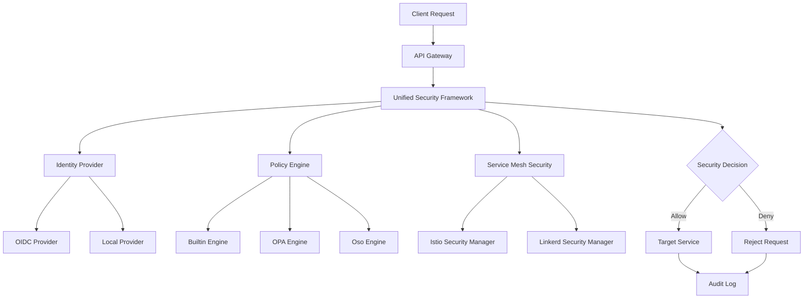

# Enhanced Security Architecture

## Overview

The Marty Microservices Framework features enterprise-grade security with unified access control, real-time service mesh integration, and comprehensive policy enforcement. This document outlines the enhanced security architecture that consolidates multiple security implementations into a cohesive, production-ready system.

## Security Architecture Principles

### 1. Unified Security Framework
- **Principle**: Single, cohesive security system consolidating all capabilities
- **Implementation**: Central UnifiedSecurityFramework class orchestrating all security operations
- **Components**: Identity providers, policy engines, service mesh security, compliance scanning
- **Benefits**: Reduced complexity, consistent security model, easier maintenance

### 2. Real-Time Service Mesh Security
- **Principle**: Runtime policy enforcement at the service mesh level
- **Implementation**: Dynamic policy application through Istio and Linkerd integration
- **Components**: Enhanced service mesh managers, traffic policies, mTLS enforcement
- **Benefits**: Zero-trust networking, runtime protection, automatic policy propagation

### 3. Zero Trust Security Model
- **Principle**: Never trust, always verify
- **Implementation**: Every request is authenticated and authorized
- **Components**: mTLS, JWT verification, certificate-based authentication
- **Benefits**: Reduced attack surface, improved compliance

### 4. Defense in Depth
- **Principle**: Multiple layers of security controls
- **Implementation**: API gateway, service mesh, application-level security
- **Components**: Authentication, authorization, encryption, audit logging
- **Benefits**: Redundant protection, graceful degradation

### 5. Policy as Code
- **Principle**: Authorization policies defined as code
- **Implementation**: Version-controlled policy definitions
- **Components**: OPA Rego policies, Oso Polar policies, JSON rules
- **Benefits**: Auditability, consistency, rapid deployment

## Unified Security Architecture

### Core Components

#### 1. Unified Security Framework
Central orchestrator for all security operations:

```python
from marty_msf.security.unified_framework import create_unified_security_framework

# Initialize comprehensive security system
security_framework = await create_unified_security_framework({
    "identity_providers": {
        "oidc": {"type": "oidc", "issuer": "https://auth.company.com"},
        "local": {"type": "local", "enabled": True}
    },
    "policy_engines": {
        "opa": {"type": "opa", "endpoint": "http://opa:8181"},
        "builtin": {"type": "builtin", "enabled": True}
    },
    "service_mesh": {
        "enabled": True,
        "type": "istio"
    }
})
```

#### 2. Enhanced Service Mesh Manager
Real-time security policy enforcement:

```python
from marty_msf.framework.service_mesh import create_enhanced_service_mesh_manager

# Create service mesh manager with security integration
enhanced_manager = create_enhanced_service_mesh_manager(
    service_mesh_type="istio",
    security_manager=security_framework
)

# Deploy with integrated security policies
await enhanced_manager.deploy_service_mesh(
    namespace="production",
    security_policies=security_policies
)
```

## Architecture Components

### 1. Identity Provider Layer

#### Pluggable Identity Providers
```python
# OIDC Integration
from marty_msf.security.providers.oidc_provider import OIDCProvider

oidc_provider = OIDCProvider({
    "issuer": "https://accounts.google.com",
    "client_id": "your-client-id",
    "client_secret": "your-client-secret"
})
```

**Supported Providers:**
- OIDC (OpenID Connect) - Enterprise SSO integration
- OAuth2 - Standard OAuth2 flows
- SAML - Enterprise SAML authentication
- Local - Built-in user management

### 2. Policy Engine Layer

#### Multi-Engine Policy Evaluation
```python
# Builtin Policy Engine (No dependencies)
from marty_msf.security.engines.builtin_engine import BuiltinPolicyEngine

builtin_engine = BuiltinPolicyEngine({
    "policies_file": "security_policies.json"
})
```

**Supported Engines:**
- **Builtin Engine**: Fast, dependency-free JSON-based policies
- **OPA (Open Policy Agent)**: Industry-standard Rego policies
- **Oso**: Python-native policy engine with Polar language

### 3. Service Mesh Security Layer

### 3. Service Mesh Security Layer

#### Real-Time Policy Enforcement
```python
# Enhanced Service Mesh Security Manager
from marty_msf.security.mesh.istio_security import IstioSecurityManager

istio_security = IstioSecurityManager({
    "cluster_endpoint": "https://k8s-api.company.com",
    "namespace": "production"
})

# Apply traffic policies with real-time enforcement
await istio_security.apply_traffic_policies([
    {
        "metadata": {"name": "payment-service-protection"},
        "spec": {
            "selector": {"matchLabels": {"app": "payment-service"}},
            "rules": [{
                "from": [{"source": {"principals": ["cluster.local/ns/frontend/sa/web"]}}],
                "to": [{"operation": {"methods": ["POST"], "paths": ["/api/v1/payments/*"]}}]
            }]
        }
    }
])
```

**Capabilities:**
- **Istio Integration**: PeerAuthentication, AuthorizationPolicy, EnvoyFilter configuration
- **Linkerd Integration**: Server, ServerAuthorization policy management
- **mTLS Enforcement**: Automatic mutual TLS between services
- **Traffic Policies**: Fine-grained traffic routing and security policies
- **Rate Limiting**: Request rate limiting at the service mesh level
- **Runtime Monitoring**: Real-time security event monitoring

#### Service Mesh Deployment Scripts
Enhanced deployment scripts with integrated security:

```bash
#!/bin/bash
# Enhanced Istio Deployment Script
# Generated by Marty Microservices Framework

# Deploy with integrated security policies
kubectl label namespace production istio-injection=enabled --overwrite

# Apply security configurations
kubectl apply -f - <<EOF
apiVersion: security.istio.io/v1beta1
kind: PeerAuthentication
metadata:
  name: payment-service-peer-auth
  namespace: production
spec:
  selector:
    matchLabels:
      app: payment-service
  mtls:
    mode: STRICT
EOF
```

### 4. Compliance and Audit Layer

#### Unified Compliance Scanner
```python
from marty_msf.security.compliance.unified_scanner import UnifiedComplianceScanner

compliance_scanner = UnifiedComplianceScanner({
    "frameworks": ["gdpr", "hipaa", "sox", "pci_dss"],
    "scan_interval": "daily"
})

# Perform compliance scan
scan_results = await compliance_scanner.scan_compliance(
    ComplianceFramework.GDPR,
    {"scope": "user_data_processing"}
)
```

**Frameworks Supported:**
- **GDPR**: General Data Protection Regulation
- **HIPAA**: Health Insurance Portability and Accountability Act
- **SOX**: Sarbanes-Oxley Act
- **PCI DSS**: Payment Card Industry Data Security Standard
- **ISO 27001**: Information security management
- **NIST**: National Institute of Standards and Technology

## Implementation Architecture

### Unified Security Flow



### Security Policy Evaluation Flow

1. **Request Interception**: API Gateway captures incoming request
2. **Authentication**: Unified framework validates identity through providers
3. **Context Creation**: Security context built with principal, resource, action
4. **Policy Evaluation**: Multiple engines evaluate applicable policies
5. **Decision Combination**: Results combined with secure defaults (deny-by-default)
6. **Service Mesh Enforcement**: Runtime policies applied at mesh level
7. **Audit Logging**: All security events logged for compliance

### Real-Time Security Monitoring

```python
# Continuous security monitoring
async def monitor_security_events():
    while True:
        # Monitor service mesh security events
        events = await security_framework.monitor_service_mesh_security("production")

        for event in events:
            if event['type'] == 'security_violation':
                await handle_security_incident(event)
            elif event['type'] == 'policy_violation':
                await update_security_policies(event)

        await asyncio.sleep(30)  # Check every 30 seconds
```

## Deployment and Configuration

### 1. Service Mesh Integration Setup

#### Istio Integration
```yaml
# Istio configuration for MMF
apiVersion: install.istio.io/v1alpha1
kind: IstioOperator
metadata:
  name: mmf-istio
spec:
  values:
    global:
      meshConfig:
        defaultConfig:
          proxyStatsMatcher:
            inclusionRegexps:
            - ".*outlier_detection.*"
            - ".*circuit_breaker.*"
          discoveryRefreshDelay: 10s
          proxyMetadata:
            ISTIO_META_DNS_CAPTURE: "true"
```

#### Linkerd Integration
```yaml
# Linkerd configuration for MMF
apiVersion: policy.linkerd.io/v1beta1
kind: ServerAuthorization
metadata:
  name: mmf-default-policy
  namespace: production
spec:
  server:
    name: mmf-server
  requiredRoutes:
  - pathRegex: "/api/v1/.*"
    methods: ["GET", "POST"]
```

### 2. Security Configuration

#### Complete Security Setup
```python
# Complete MMF security configuration
security_config = {
    "identity_providers": {
        "oidc": {
            "type": "oidc",
            "issuer": "https://auth.company.com",
            "client_id": "mmf-client",
            "enabled": True
        },
        "local": {
            "type": "local",
            "enabled": True,
            "users_file": "/etc/mmf/users.json"
        }
    },
    "policy_engines": {
        "builtin": {
            "type": "builtin",
            "enabled": True,
            "policies_file": "/etc/mmf/policies.json"
        },
        "opa": {
            "type": "opa",
            "endpoint": "http://opa.security:8181",
            "enabled": False
        }
    },
    "service_mesh": {
        "enabled": True,
        "type": "istio",
        "namespace": "istio-system",
        "auto_inject": True
    },
    "compliance": {
        "enabled": True,
        "frameworks": ["gdpr", "hipaa"],
        "scan_schedule": "0 2 * * *"  # Daily at 2 AM
    },
    "audit": {
        "enabled": True,
        "retention_days": 90,
        "log_level": "INFO"
    }
}
```

## Security Features by Component

### Authentication Features
- **Multi-Provider Support**: OIDC, OAuth2, SAML, Local
- **Token Validation**: JWT validation with JWKS support
- **Session Management**: Secure session handling with expiration
- **Service Account Authentication**: Kubernetes service account integration

### Authorization Features
- **RBAC (Role-Based Access Control)**: Role and permission management
- **ABAC (Attribute-Based Access Control)**: Fine-grained attribute policies
- **Policy Caching**: Performance optimization with secure caching
- **Real-Time Evaluation**: Dynamic policy evaluation for each request

### Service Mesh Features
- **Automatic mTLS**: Mutual TLS between all services
- **Traffic Policies**: L4 and L7 traffic security policies
- **Rate Limiting**: Request rate limiting and throttling
- **Security Monitoring**: Real-time security event detection
- **Policy Enforcement**: Runtime security policy application

### Compliance Features
- **Multi-Framework Support**: GDPR, HIPAA, SOX, PCI DSS compliance
- **Automated Scanning**: Scheduled compliance violation detection
- **Reporting**: Comprehensive compliance reports
- **Remediation Guidance**: Actionable remediation recommendations

## Migration from Legacy Implementations

### Consolidation Strategy

The enhanced security framework consolidates multiple existing implementations:

#### Before (Scattered Implementations)
- `src/marty_msf/authorization.py` - Basic RBAC
- `src/marty_msf/authorization/manager.py` - Enhanced RBAC
- `src/marty_msf/identity_access/` - Identity management
- `src/marty_msf/gateway/auth.py` - Gateway authentication

#### After (Unified Framework)
- `src/marty_msf/security/unified_framework.py` - Central security orchestrator
- `src/marty_msf/security/providers/` - Pluggable identity providers
- `src/marty_msf/security/engines/` - Pluggable policy engines
- `src/marty_msf/security/mesh/` - Service mesh security managers

### Migration Steps

1. **Assessment**: Identify existing security implementations
2. **Configuration**: Configure unified security framework
3. **Integration**: Integrate enhanced service mesh manager
4. **Testing**: Validate security policies and enforcement
5. **Deployment**: Deploy with real-time monitoring
6. **Deprecation**: Remove legacy security implementations

## Best Practices

### Security Policy Design
- **Principle of Least Privilege**: Grant minimal necessary permissions
- **Defense in Depth**: Layer multiple security controls
- **Fail Secure**: Default to deny when policies are unclear
- **Audit Everything**: Log all security-related events

### Service Mesh Security
- **Enable mTLS**: Always use mutual TLS between services
- **Segment Networks**: Use namespaces and network policies
- **Monitor Traffic**: Implement comprehensive traffic monitoring
- **Regular Updates**: Keep service mesh components updated

### Compliance Management
- **Continuous Monitoring**: Regular compliance scans
- **Documentation**: Maintain compliance documentation
- **Training**: Security awareness training for developers
- **Incident Response**: Defined security incident procedures

## Performance Considerations

### Security Framework Performance
- **Policy Caching**: 5-minute cache TTL for authorization decisions
- **Async Operations**: All security operations are asynchronous
- **Connection Pooling**: Efficient external service connections
- **Metrics Collection**: Performance metrics for optimization

### Service Mesh Performance
- **Resource Limits**: Appropriate CPU/memory limits for sidecars
- **Proxy Configuration**: Optimized Envoy/Linkerd proxy settings
- **Health Checking**: Comprehensive health check configuration
- **Load Balancing**: Intelligent load balancing algorithms

## Troubleshooting

### Common Issues

#### Authentication Failures
```bash
# Check identity provider status
kubectl logs -n security deployment/oidc-provider

# Validate JWT tokens
curl -X POST https://auth.company.com/token/validate \
  -H "Authorization: Bearer $TOKEN"
```

#### Authorization Denials
```bash
# Check policy evaluation logs
kubectl logs -n security deployment/policy-engine

# Test policies directly
mmf-cli policy test --principal user:alice --resource /api/users --action GET
```

#### Service Mesh Issues
```bash
# Check Istio proxy status
istioctl proxy-status

# Validate mTLS configuration
istioctl authn tls-check payment-service.production.svc.cluster.local

# Monitor security events
kubectl logs -n istio-system deployment/istiod | grep -i security
```

## Monitoring and Alerting

### Security Metrics
- Authentication success/failure rates
- Authorization decision latency
- Policy evaluation performance
- Service mesh security events
- Compliance violation counts

### Recommended Alerts
- High authentication failure rate (>5% over 5 minutes)
- Authorization policy violations (any explicit deny)
- Service mesh security events (unauthorized traffic)
- Compliance violations (any critical findings)
- Security framework errors (system health issues)

## Future Enhancements

### Planned Features
- **Machine Learning Security**: Anomaly detection for security events
- **Advanced Threat Detection**: Behavioral analysis and threat hunting
- **Zero-Trust Networking**: Complete network segmentation
- **Automated Remediation**: Self-healing security responses
- **Enhanced Compliance**: Additional regulatory framework support

This enhanced security architecture provides a robust, scalable, and maintainable security foundation for the Marty Microservices Framework, consolidating multiple security capabilities into a unified, production-ready system.
```python
# Core component: VaultClient
from marty_msf.security.secrets import VaultClient, VaultConfig

vault_client = VaultClient(VaultConfig(
    url="https://vault.company.com",
    auth_method=VaultAuthMethod.KUBERNETES,
    role="marty-msf-service"
))
```

**Capabilities:**
- Multiple authentication methods (Token, Kubernetes, AWS IAM, AppRole, UserPass)
- Secret engines (KV v2, Database, PKI, Transit)
- Certificate generation and management
- Encryption as a service
- Automatic secret rotation

**Infrastructure Requirements:**
- HashiCorp Vault cluster (minimum 3 nodes for HA)
- Vault Agent for local caching (optional)
- Network connectivity to Vault API
- Service accounts with appropriate roles

#### Multi-Backend Secret Manager
```python
# Enhanced secret manager with fallback
secret_manager = SecretManager(
    service_name="payment-service",
    vault_client=vault_client,
    backends=[
        SecretBackend.VAULT,      # Primary
        SecretBackend.KUBERNETES, # Fallback
        SecretBackend.ENVIRONMENT # Last resort
    ]
)
```

**Features:**
- Backend preference ordering
- Automatic failover
- Secret metadata tracking
- Health monitoring
- Rotation management

### 2. Authorization Layer

#### Policy Engine Architecture
```python
# Multi-engine policy manager
policy_manager = PolicyManager(
    primary_engine=PolicyEngineEnum.OPA,
    fallback_engines=[PolicyEngineEnum.OSO, PolicyEngineEnum.BUILTIN]
)
```

**Engine Capabilities:**

| Engine | Use Case | Strengths | Language |
|--------|----------|-----------|----------|
| OPA | Complex ABAC policies | Rego language, external data | Rego |
| Oso | Fine-grained permissions | Python integration, flexible | Polar |
| Builtin | Simple RBAC | Fast evaluation, JSON config | JSON |

**Policy Examples:**

**RBAC (Role-Based Access Control):**
```json
{
  "rules": [
    {
      "resource": "/api/v1/users/*",
      "action": "GET",
      "principal": {"roles": ["admin", "user"]},
      "effect": "allow"
    }
  ]
}
```

**ABAC (Attribute-Based Access Control):**
```rego
allow if {
    input.action == "POST"
    input.resource == "/api/v1/transactions"
    "finance_manager" in input.principal.roles
    input.environment.transaction_amount > 10000
    business_hours
}
```

### 3. Gateway Security Integration

#### Enhanced Security Middleware
```python
# FastAPI integration
middleware = await create_enhanced_security_middleware(
    secret_manager=secret_manager,
    policy_manager=policy_manager,
    require_mtls=True,
    audit_enabled=True
)
```

**Security Pipeline:**
1. **Request Authentication**
   - mTLS certificate validation
   - JWT token verification
   - API key validation

2. **Authorization Evaluation**
   - Policy engine consultation
   - Context-aware decisions
   - Audit logging

3. **Secret Injection**
   - Automatic secret resolution
   - Context-based secret access
   - Secure secret transmission

### 4. gRPC Security Interceptors

#### Service-to-Service Security
```python
# gRPC server with security
server = grpc.aio.server(interceptors=[
    create_authentication_interceptor(secret_manager),
    create_authorization_interceptor(policy_manager),
    create_secret_injection_interceptor(secret_manager)
])
```

**Interceptor Functions:**
- **Authentication**: Certificate and token validation
- **Authorization**: Policy-based access control
- **Secret Injection**: Automatic secret provisioning
- **Audit Logging**: Comprehensive request tracking

## Infrastructure Requirements

### 1. HashiCorp Vault Deployment

#### Production Deployment
```yaml
# Minimum requirements
Resources:
  - CPU: 2 cores per node
  - Memory: 4GB per node
  - Storage: 100GB SSD per node
  - Network: High availability networking

High Availability:
  - 3+ Vault nodes
  - Raft or Consul storage backend
  - Load balancer with health checks
  - Auto-unseal with cloud KMS
```

#### Development Setup
```bash
# Docker Compose for development
docker-compose -f examples/security/vault-configs/docker-compose.yaml up -d
```

### 2. Policy Engine Infrastructure

#### Open Policy Agent (OPA)
```yaml
# Kubernetes deployment
Resources:
  - CPU: 100m-500m
  - Memory: 128Mi-512Mi
  - Replicas: 2+ for HA

Configuration:
  - Bundle server for policy distribution
  - Decision logging
  - Status reporting
```

#### Oso Integration
```python
# In-process policy evaluation
# No additional infrastructure required
# Policies loaded from configuration
```

### 3. Certificate Management

#### PKI Infrastructure
```
Certificate Hierarchy:
├── Root CA (Vault)
├── Intermediate CA (Per Environment)
└── Service Certificates (Short-lived, 24h TTL)

Rotation Strategy:
- Automatic certificate renewal
- Graceful service restart
- Certificate monitoring and alerting
```

### 4. Networking and Security

#### Network Security
```yaml
Network Policies:
  - Vault access restricted to authenticated services
  - mTLS for all service-to-service communication
  - Network segmentation by environment
  - Firewall rules for external access

Load Balancing:
  - TLS termination at load balancer
  - Backend certificate validation
  - Health check endpoints
```

## Security Patterns and Best Practices

### 1. Authentication Patterns

#### Service-to-Service Authentication
```python
# mTLS with short-lived certificates
@app.middleware("https")
async def verify_client_cert(request: Request, call_next):
    cert = request.client.cert
    if not verify_certificate(cert):
        raise HTTPException(401, "Invalid certificate")
    return await call_next(request)
```

#### User Authentication
```python
# JWT with Vault-managed signing keys
async def verify_jwt_token(token: str) -> dict:
    signing_key = await secret_manager.get_secret("jwt/signing_key")
    return jwt.decode(token, signing_key, algorithms=["HS256"])
```

### 2. Authorization Patterns

#### Context-Aware Authorization
```python
# Request context evaluation
auth_request = AuthorizationRequest(
    principal={"user_id": user.id, "roles": user.roles},
    action=request.method,
    resource=request.url.path,
    environment={
        "source_ip": request.client.host,
        "time": datetime.now(),
        "user_agent": request.headers.get("user-agent")
    }
)
```

#### Policy Composition
```python
# Multiple policy evaluation
policies = ["rbac_users", "abac_financial", "compliance_policy"]
result = await policy_manager.evaluate(auth_request, policies)
```

### 3. Secret Management Patterns

#### Dynamic Secret Retrieval
```python
# Secrets retrieved at runtime
@app.dependency
async def get_database_credentials():
    return await secret_manager.get_secret("database/credentials")
```

#### Secret Rotation
```python
# Automatic rotation monitoring
@background_task
async def monitor_secret_rotation():
    secrets_to_rotate = secret_manager.get_secrets_needing_rotation()
    for secret_key in secrets_to_rotate:
        await secret_manager.rotate_secret(secret_key)
```

## Compliance and Audit

### 1. Audit Logging
```python
# Comprehensive audit trail
audit_event = {
    "timestamp": datetime.utcnow(),
    "service": "payment-service",
    "user_id": principal.user_id,
    "action": "create_transaction",
    "resource": "/api/v1/transactions",
    "decision": "allow",
    "policy_engine": "opa",
    "source_ip": request.client.host
}
```

### 2. Compliance Controls
- **PCI DSS**: Secret encryption, access logging, network segmentation
- **SOX**: Policy versioning, approval workflows, audit trails
- **GDPR**: Data access controls, encryption at rest and in transit
- **HIPAA**: Authentication requirements, audit logging, data encryption

## Monitoring and Observability

### 1. Security Metrics
```python
# Key security metrics
metrics = {
    "authentication_failures": Counter(),
    "authorization_denials": Counter(),
    "secret_rotation_events": Counter(),
    "certificate_expiration_warnings": Counter(),
    "policy_evaluation_latency": Histogram()
}
```

### 2. Health Checks
```python
# Security health monitoring
@app.get("/health/security")
async def security_health():
    return {
        "vault_connected": await vault_client.health_check(),
        "policy_engines_active": await policy_manager.health_check(),
        "certificates_valid": await check_certificate_validity(),
        "secret_rotation_current": check_rotation_status()
    }
```

## Migration and Deployment

### 1. Migration Strategy
```
Phase 1: Infrastructure Setup
- Deploy Vault cluster
- Configure authentication methods
- Setup initial policies

Phase 2: Secret Migration
- Migrate secrets from existing stores
- Update service configurations
- Test secret retrieval

Phase 3: Policy Implementation
- Deploy authorization policies
- Enable policy enforcement
- Monitor and adjust

Phase 4: Full Security Enablement
- Enable mTLS everywhere
- Activate audit logging
- Performance optimization
```

### 2. Rollback Plan
```
Emergency Procedures:
1. Disable policy enforcement
2. Fallback to environment secrets
3. Use bypass authentication
4. Restore from backups
5. Gradual re-enablement
```

## Performance Considerations

### 1. Latency Optimization
- **Secret Caching**: Local cache with TTL
- **Policy Caching**: In-memory policy evaluation
- **Connection Pooling**: Reuse Vault connections
- **Async Operations**: Non-blocking secret retrieval

### 2. Scalability
- **Horizontal Scaling**: Multiple policy engine instances
- **Load Distribution**: Round-robin policy evaluation
- **Resource Limits**: CPU and memory constraints
- **Circuit Breakers**: Fallback mechanisms

## Troubleshooting Guide

### 1. Common Issues

#### Vault Authentication Failures
```bash
# Check Vault status
vault status

# Verify authentication
vault auth -method=kubernetes role=marty-msf

# Check policies
vault policy read marty-msf-policy
```

#### Policy Evaluation Errors
```bash
# Test policy evaluation
curl -X POST http://opa:8181/v1/data/authz/allow \
  -d '{"input": {"principal": {...}, "action": "GET", "resource": "/api/users"}}'

# Check policy syntax
opa fmt --diff policy.rego
```

#### Certificate Issues
```bash
# Check certificate validity
openssl x509 -in cert.pem -text -noout

# Verify certificate chain
openssl verify -CAfile ca.pem cert.pem
```

### 2. Debugging Tools

#### Security Audit Script
```python
# Comprehensive security audit
async def security_audit():
    results = {
        "vault_health": await vault_client.health_check(),
        "expired_secrets": get_expired_secrets(),
        "policy_conflicts": check_policy_conflicts(),
        "certificate_expiry": check_certificate_expiry()
    }
    return results
```

## Future Enhancements

### 1. Planned Features
- **Dynamic Policy Updates**: Real-time policy reloading
- **Advanced Threat Detection**: ML-based anomaly detection
- **Secret Scanning**: Automated secret detection in code
- **Compliance Automation**: Automated compliance reporting

### 2. Integration Roadmap
- **Service Mesh Integration**: Istio/Linkerd policy integration
- **Cloud Provider Integration**: AWS/Azure/GCP native services
- **Third-Party Tools**: Integration with security scanners
- **API Security**: Rate limiting, DDoS protection

## Conclusion

The enhanced security architecture provides enterprise-grade security capabilities while maintaining the simplicity and flexibility of the Marty Microservices Framework. The multi-layered approach ensures robust protection against various threat vectors while supporting compliance requirements and operational excellence.

Key benefits:
- **Reduced Security Risk**: Comprehensive protection across all layers
- **Improved Compliance**: Built-in audit and control capabilities
- **Operational Efficiency**: Automated secret management and policy enforcement
- **Developer Productivity**: Simple APIs and graceful degradation
- **Future-Proof Design**: Extensible architecture for emerging threats
