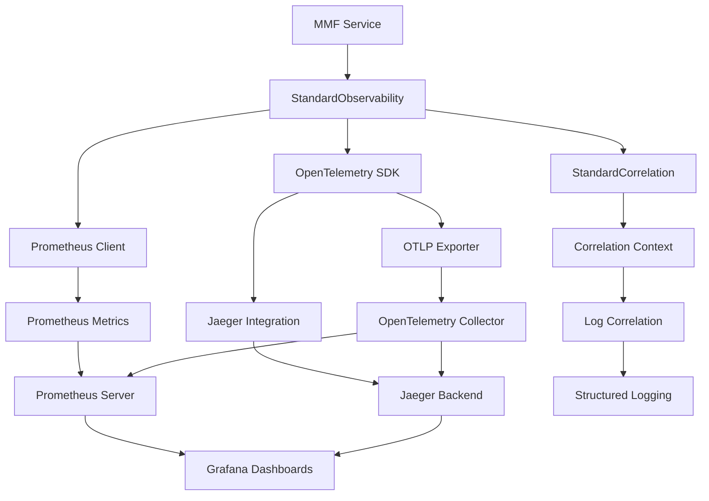

````markdown
# MMF Standard Observability Architecture

## Overview

This document defines the **standardized observability architecture** for the Marty Microservices Framework (MMF). The implementation consolidates multiple previous observability approaches into a single, comprehensive, and unified system that provides consistent instrumentation across all service types.

## Architectural Decisions

### 1. **Unified Implementation Strategy**
- **Decision**: Replace multiple observability implementations with a single standardized system
- **Rationale**: Eliminates duplication, reduces maintenance overhead, and ensures consistency
- **Implementation**: `marty_msf.observability.standard` module provides the core implementation

### 2. **Required Dependencies Approach**
- **Decision**: OpenTelemetry instrumentation packages are required dependencies, not optional
- **Rationale**: Ensures consistent observability across all MMF services without conditional logic
- **Implementation**: Added to `pyproject.toml` observability extras

### 3. **Zero-Configuration Observability**
- **Decision**: All service templates include observability by default with no additional setup required
- **Rationale**: Plugin developers get comprehensive observability without any configuration effort
- **Implementation**: Automatic initialization in all service templates

## Architecture Components

### Core Observability Stack



### Standard Instrumentation

#### Automatic Instrumentation
All services automatically instrument:
- **HTTP Clients**: HTTPX, Requests
- **Databases**: SQLAlchemy, psycopg2
- **Caching**: Redis
- **Service Communication**: FastAPI, gRPC
- **Message Queues**: Kafka, RabbitMQ (when used)

#### Standard Metrics
Every service exposes consistent metrics:
```
mmf_<service_type>_requests_total{method, endpoint, status_code}
mmf_<service_type>_request_duration_seconds{method, endpoint}
mmf_<service_type>_active_requests
mmf_<service_type>_plugin_operations_total{plugin_id, operation, status}
mmf_<service_type>_errors_total{error_type, endpoint}
```

### Correlation ID System

#### Multi-Dimensional Correlation
- **Primary ID**: `x-mmf-correlation-id` - Main request correlation
- **Request ID**: `x-mmf-request-id` - Individual request identifier
- **User Context**: `x-mmf-user-id` - User session tracking
- **Session Context**: `x-mmf-session-id` - User session management
- **Operation Context**: `x-mmf-operation-id` - Specific operation tracking
- **Plugin Context**: `x-mmf-plugin-id` - Plugin operation debugging

#### Propagation Strategy
- **HTTP Services**: Via middleware that automatically extracts/injects headers
- **gRPC Services**: Via interceptors that handle metadata propagation
- **Cross-Service**: Automatic propagation through instrumented HTTP clients
- **Async Operations**: Context variables maintain correlation across async boundaries

## Implementation Details

### Service Integration

#### FastAPI Services
```python
from marty_msf.observability.standard import create_standard_observability
from marty_msf.observability.standard_correlation import StandardCorrelationMiddleware

# Zero-config initialization
observability = create_standard_observability(
    service_name="my-service",
    service_version="1.0.0",
    service_type="fastapi"
)
await observability.initialize()

# Automatic instrumentation
app.add_middleware(StandardCorrelationMiddleware)
observability.instrument_fastapi(app)
```

#### gRPC Services
```python
from marty_msf.observability.standard import create_standard_observability
from marty_msf.observability.standard_correlation import StandardCorrelationInterceptor

# Initialize with gRPC-specific configuration
observability = create_standard_observability(
    service_name="my-grpc-service",
    service_type="grpc"
)
await observability.initialize()

# Add correlation interceptor
server.add_interceptor(StandardCorrelationInterceptor())
observability.instrument_grpc_server(server)
```

#### Hybrid Services
```python
# Combines both FastAPI and gRPC observability
observability = create_standard_observability(
    service_name="my-hybrid-service",
    service_type="hybrid"
)
await observability.initialize()

# Instrument both interfaces
app.add_middleware(StandardCorrelationMiddleware)
observability.instrument_fastapi(app)
observability.instrument_grpc_server(grpc_server)
```

### Configuration Standards

#### Environment Variables
```bash
# Service identification
OTEL_SERVICE_NAME=my-service
OTEL_SERVICE_VERSION=1.0.0
DEPLOYMENT_ENVIRONMENT=production

# OpenTelemetry configuration
OTEL_EXPORTER_OTLP_ENDPOINT=http://opentelemetry-collector:4317
JAEGER_ENDPOINT=http://jaeger:14268/api/traces

# Sampling configuration (environment-specific defaults)
# Development: 100%, Staging: 50%, Production: 10%

# Prometheus configuration
PROMETHEUS_ENABLED=true
PROMETHEUS_PORT=8000
```

#### Resource Attributes
All services include standardized resource attributes:
- `service.name`: Unique service identifier
- `service.version`: Semantic version
- `deployment.environment`: Environment (dev/staging/prod)
- `mmf.service.type`: Service type (fastapi/grpc/hybrid)
- `mmf.framework.version`: MMF framework version
- `mmf.observability.standard`: "true" to identify standard implementation

## Infrastructure Components

### OpenTelemetry Collector Configuration
```yaml
receivers:
  otlp:
    protocols:
      grpc:
        endpoint: 0.0.0.0:4317
      http:
        endpoint: 0.0.0.0:4318

processors:
  batch:
  memory_limiter:
    limit_mib: 512

exporters:
  jaeger:
    endpoint: jaeger:14250
    tls:
      insecure: true
  prometheus:
    endpoint: "0.0.0.0:8889"

service:
  pipelines:
    traces:
      receivers: [otlp]
      processors: [memory_limiter, batch]
      exporters: [jaeger]
    metrics:
      receivers: [otlp]
      processors: [memory_limiter, batch]
      exporters: [prometheus]
```

### Grafana Dashboard Integration

#### Standard Dashboards
1. **Service Overview** (`mmf-standard-service-overview.json`)
   - Request rate, error rate, response times
   - Active requests and plugin operations
   - Correlation ID coverage metrics

2. **Plugin Debugging** (`mmf-plugin-debugging.json`)
   - Plugin operation tracking by ID
   - Cross-service plugin communication
   - Correlation-based log analysis

3. **Distributed Tracing** (`mmf-distributed-tracing.json`)
   - Trace duration analysis
   - Service dependency mapping
   - Trace error analysis with correlation

#### Dashboard Features
- **Correlation Integration**: Direct links to Jaeger traces with correlation IDs
- **Plugin Focus**: Specialized views for plugin developer troubleshooting
- **Multi-Service**: Unified views across FastAPI, gRPC, and hybrid services
- **Real-time**: 5-second refresh for immediate feedback

## Plugin Developer Benefits

### Zero-Configuration Observability
- No setup required - observability works out of the box
- Consistent metrics across all service types
- Automatic correlation ID propagation

### Debugging Utilities
```python
from marty_msf.observability.standard_correlation import (
    set_plugin_correlation,
    get_current_correlation,
    inject_correlation_to_span
)

# Set plugin context for operations
set_plugin_correlation("my-plugin", "data-processing")

# Get current correlation context
correlation = get_current_correlation()

# Inject correlation into OpenTelemetry spans
inject_correlation_to_span()
```

### Specialized Dashboards
- Plugin-specific performance metrics
- Cross-service plugin communication visualization
- Correlation-based log filtering
- Plugin operation success/failure tracking

## Migration Path

### From Existing Implementations
1. **Phase 1**: New services use standard observability automatically
2. **Phase 2**: Existing services migrate to standard implementation
3. **Phase 3**: Remove legacy observability implementations
4. **Phase 4**: Update documentation and training materials

### Backward Compatibility
- Legacy metric names supported during transition period
- Gradual migration without service disruption
- Clear migration guides for each service type

## Performance Considerations

### Overhead Optimization
- Environment-specific sampling rates (10% in production)
- Efficient correlation context management using context variables
- Batch processing for trace and metric export
- Memory limits and resource monitoring

### Scalability
- OTLP protocol for efficient data transport
- Collector-based architecture for centralized processing
- Prometheus federation for large deployments
- Jaeger backend scaling strategies

## Monitoring and Alerting

### Standard Alerts
- High error rates (>5%)
- High response times (P95 > 1s)
- Low correlation coverage (<95%)
- Plugin operation failures
- Missing observability data

### Health Checks
- Observability system health monitoring
- Data flow validation
- Dashboard availability
- Collector performance monitoring

## Future Enhancements

### Planned Features
- Automatic SLO/SLI generation
- ML-based anomaly detection
- Advanced correlation analysis
- Cost optimization recommendations
- Multi-cluster observability

### Plugin Ecosystem
- Plugin-specific observability patterns
- Custom metric and trace generators
- Advanced debugging tools
- Performance optimization guides

## Conclusion

The MMF Standard Observability Architecture provides a comprehensive, zero-configuration observability solution that:

- **Eliminates Complexity**: Single implementation replaces multiple systems
- **Ensures Consistency**: All services have identical observability patterns
- **Enables Debugging**: Rich correlation and tracing support for plugin developers
- **Scales Effectively**: Optimized for production environments
- **Reduces Maintenance**: Centralized implementation and configuration

This architecture enables plugin developers to focus on business logic while receiving enterprise-grade observability automatically, supporting the MMF goal of providing a world-class microservices platform.
````
