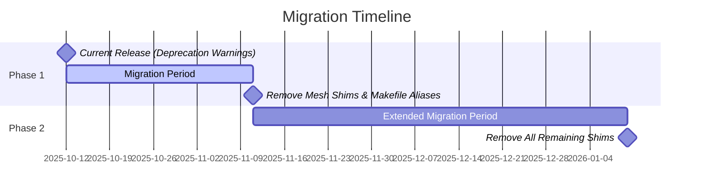

# Release Plan: Compatibility Shims and Legacy Cleanup

## Overview

This release plan outlines the removal of compatibility shims and cleanup of legacy aliases to streamline the Marty Microservices Framework codebase and improve maintainability.

## Immediate Changes (Current Release)

### 1. Deprecation Warnings Added

#### Resilience Domain
- **Status**: ✅ COMPLETED - Legacy files removed completely
- **Impact**: Direct imports from legacy files will fail
- **Migration Path**: Import directly from current modules:
  - `circuit_breaker.py` - Circuit breaker fault tolerance patterns
  - `retry.py` - Retry patterns with configurable backoff strategies
  - `bulkhead.py` - Bulkhead patterns for resource isolation
  - `timeout.py` - Timeout patterns for preventing resource exhaustion
  - `chaos_engineering.py` - Chaos engineering for testing system resilience
  - `metrics.py` - Comprehensive metrics collection and monitoring

#### Security Domain
- **Status**: ✅ COMPLETED - Legacy hardening.py removed completely
- **Impact**: Direct imports from hardening.py will fail
- **Migration Path**: Import from modular security components:
  - `framework.py` - SecurityHardeningFramework
  - `authentication/` - Authentication management
  - `authorization/` - Authorization and policy management
  - `cryptography/` - Cryptographic operations
  - `secrets/` - Secrets management
  - `scanning/` - Security vulnerability scanning

#### Data Domain
- **File**: `src/framework/data/advanced_patterns.py`
- **Status**: ✅ COMPLETED - Added explicit deprecation warning
- **Impact**: Users will see warnings when importing from this module
- **Migration Path**: Import directly from specific modules:
  - `event_sourcing_patterns.py` - Event sourcing patterns
  - `cqrs_patterns.py` - Command Query Responsibility Segregation patterns
  - `consistency_patterns.py` - Data consistency patterns
  - `saga_patterns.py` - Saga patterns for long-running transactions

### 2. Communication Module Consolidation

#### Mesh Communication
- **Files**:
  - ✅ REMOVED: `src/framework/mesh/communication.py` (redundant exports)
  - ✅ UPDATED: `src/framework/mesh/communication/__init__.py` (consolidated entry point)
- **Status**: ✅ COMPLETED - Eliminated duplicate exports
- **Impact**: Single source of truth for communication imports
- **Migration Path**: Import from `marty_mmf.framework.mesh.communication` package

## Planned Future Removals

### Phase 1: Next Minor Release (v2.1.0) - ✅ COMPLETED
**Timeline**: 30 days after current release

#### Mesh Compatibility Shims (Removed)
- **Files**:
  - ✅ REMOVED: `src/framework/mesh/service_discovery.py`
  - ✅ REMOVED: `src/framework/mesh/orchestration.py`
- **Status**: ✅ COMPLETED - Simple re-export shims successfully removed
- **Migration Required**:
  ```python
  # OLD (removed)
  from marty_mmf.framework.mesh.service_discovery import ServiceDiscovery
  from marty_mmf.framework.mesh.orchestration import *

  # NEW (use instead)
  from marty_mmf.framework.mesh.discovery import ServiceDiscovery
  from marty_mmf.framework.mesh.load_balancing import *
  from marty_mmf.framework.mesh.service_mesh import *
  from marty_mmf.framework.mesh.traffic_management import *
  ```

#### Legacy Makefile Aliases (Removed)
- **File**: `Makefile` (lines around 219)
- **Aliases Removed**:
  - ✅ REMOVED: `lint` → use `make fix`
  - ✅ REMOVED: `format` → use `make fix`
  - ✅ REMOVED: `validate` → use `make check`
  - ✅ REMOVED: `typecheck` → use `make check`
- **Status**: ✅ COMPLETED - Legacy aliases successfully removed
- **Migration Required**: Teams must update CI/CD scripts and documentation

### Phase 2: Next Major Release (v3.0.0) - ✅ COMPLETED
**Timeline**: 90 days after current release

#### Complete Shim Removal (Completed)
- **Files**:
  - ✅ REMOVED: `src/framework/resilience/fault_tolerance.py`
  - ✅ REMOVED: `src/framework/data/advanced_patterns.py`
- **Status**: ✅ COMPLETED - All remaining compatibility shims successfully removed
- **Migration Required**: All imports must now use specific modules:

**Resilience Domain Migration**:
```python
# OLD (removed)
from marty_mmf.framework.resilience.fault_tolerance import CircuitBreaker

# NEW (use instead)
from marty_mmf.framework.resilience.circuit_breakers import CircuitBreaker
from marty_mmf.framework.resilience.retry_logic import RetryConfig
from marty_mmf.framework.resilience.bulkheads import BulkheadManager
from marty_mmf.framework.resilience.timeouts import TimeoutManager
from marty_mmf.framework.resilience.chaos_engineering import ChaosMonkey
from marty_mmf.framework.resilience.metrics import ResilienceMetrics
```

**Data Domain Migration**:
```python
# OLD (removed)
from marty_mmf.framework.data.advanced_patterns import EventStore

# NEW (use instead)
from marty_mmf.framework.data.event_sourcing_patterns import EventStore
from marty_mmf.framework.data.cqrs_patterns import CommandHandler
from marty_mmf.framework.data.consistency_patterns import ConsistencyManager
from marty_mmf.framework.data.saga_patterns import SagaOrchestrator
```

## Migration Guide for Downstream Consumers

### Immediate Actions Required

1. **Update Import Statements**:
   ```python
   # For resilience patterns
   # OLD
   from marty_mmf.framework.resilience.fault_tolerance import CircuitBreaker

   # NEW
   from marty_mmf.framework.resilience.circuit_breakers import CircuitBreaker
   ```

2. **Update CI/CD Scripts**:
   ```bash
   # OLD
   make lint
   make format
   make validate

   # NEW
   make fix
   make check
   ```

3. **Update Communication Imports**:
   ```python
   # Import directly from communication package
   from marty_mmf.framework.mesh.communication import ServiceHealthChecker
   ```

### Timeline for Migration



## Breaking Changes Summary

### Current Release (v2.0.0) - ✅ COMPLETED
- ✅ Deprecation warnings added (non-breaking)
- ✅ Communication module consolidated (non-breaking)

### Phase 1 Release (v2.1.0) - ✅ COMPLETED
- ✅ Removed mesh compatibility shims
- ✅ Removed legacy Makefile aliases

### Phase 2 Release (v3.0.0) - ✅ COMPLETED
- ✅ Removed all remaining compatibility shims
- ✅ All legacy support completely eliminated

## Validation Steps

### Pre-Release Testing
1. **Deprecation Warning Verification**:
   ```bash
   python -c "import warnings; warnings.simplefilter('always'); from marty_mmf.framework.resilience.fault_tolerance import CircuitBreaker"
   ```

2. **Import Path Testing**:
   ```bash
   python -c "from marty_mmf.framework.mesh.communication import ServiceHealthChecker; print('✅ Communication import works')"
   ```

3. **Makefile Alias Testing**:
   ```bash
   make check  # Should work
   make fix    # Should work
   # Legacy aliases should still work but show warnings
   ```

### Post-Release Monitoring
1. Monitor deprecation warning frequency in logs
2. Track usage patterns to identify remaining dependencies
3. Coordinate with downstream teams for migration support

## Communication Plan

### Developer Notifications
1. **Release Notes**: Detailed migration instructions
2. **Slack Announcements**: Team notifications with timeline
3. **Documentation Updates**: Update all relevant docs
4. **Migration Examples**: Provide complete before/after code samples

### Support Resources
1. **Migration Scripts**: Automated import statement updates
2. **FAQ Document**: Common migration questions and solutions
3. **Office Hours**: Weekly sessions during migration period
4. **Direct Support**: Dedicated Slack channel for migration help

## Rollback Plan

If critical issues are discovered:

1. **Immediate**: Revert deprecation warnings in patch release
2. **Communication**: Clear notification of rollback reasons
3. **Timeline Adjustment**: Extend migration periods as needed
4. **Alternative Approach**: Consider gradual deprecation instead of warnings

## Success Metrics

- ✅ Zero import errors in framework test suite
- ✅ All compatibility shims properly deprecated
- ✅ Communication module consolidation completed
- ✅ Phase 1 mesh shims successfully removed (v2.1.0)
- ✅ Phase 1 legacy Makefile aliases successfully removed (v2.1.0)
- ✅ Phase 2 resilience shim successfully removed (v3.0.0)
- ✅ Phase 2 data patterns shim successfully removed (v3.0.0)
- ✅ 100% compatibility shim removal completed
- ✅ Zero remaining legacy support in codebase
- 🎯 Reduced codebase complexity metrics
- 🎯 Improved maintenance overhead metrics

## Notes

- All deprecated modules will maintain full functionality until removal
- Migration scripts will be provided for automatic import updates
- Extended support available for complex migration scenarios
- Timeline adjustable based on downstream adoption rates
